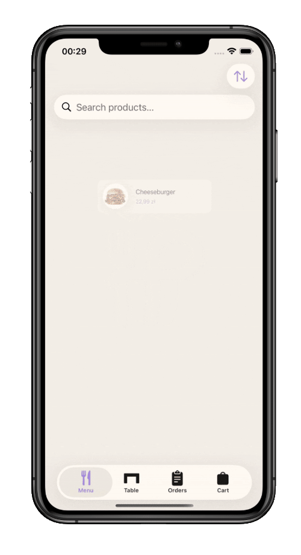
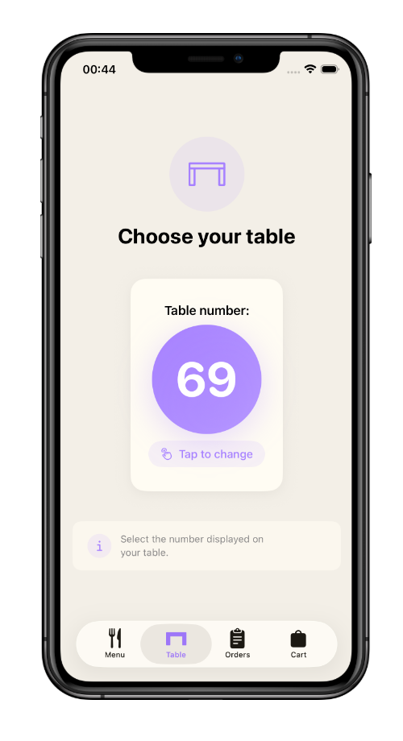
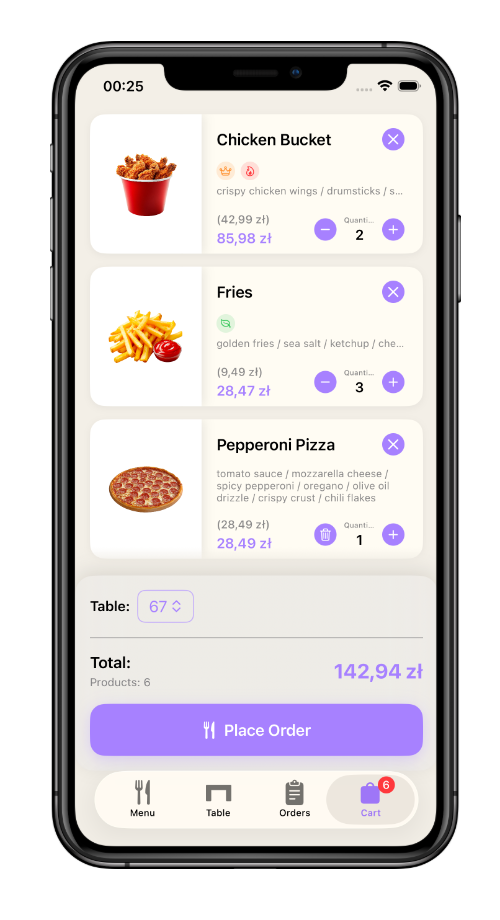
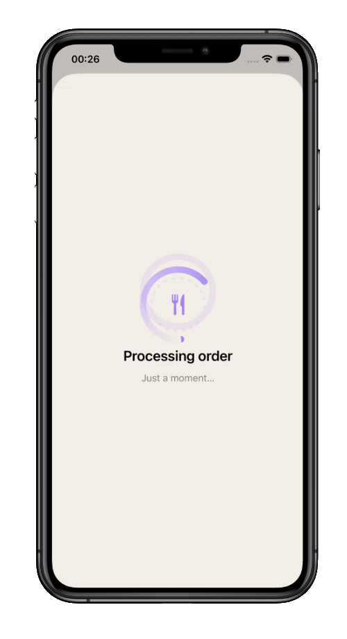
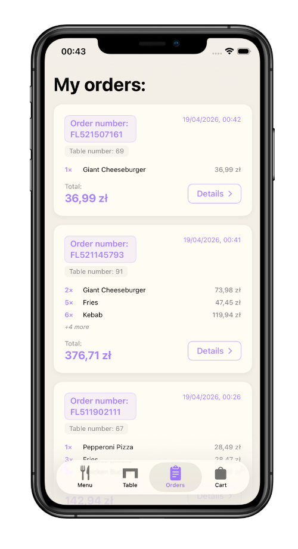
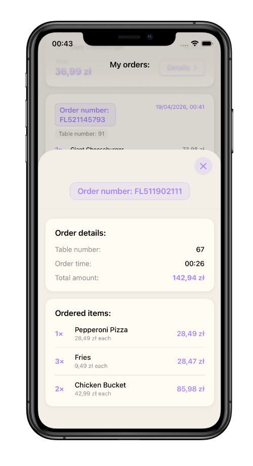

# 🍽 Foodloop

> **Restaurant ordering app for iOS** — browse the menu, pick your table, place your order. Built entirely in Swift with zero external dependencies.


---

## About

Foodloop simulates the experience of ordering food at a restaurant — entirely from your phone. You walk in, sit down at a table, open the app, choose your **table number**, browse the menu, and place your order. **You pay when the waiter comes** — just like in a real restaurant.

In production, the order would go straight to the kitchen. Here it fires off to **[httpbin.org](https://httpbin.org)**, which echoes the request payload back — so you can open the app in Xcode, place an order, and see the **full JSON logged in the console** in real time.

---

## How it works

```
Browse menu  →  Choose table  →  Add to cart  →  Place order  →  httpbin.org (→ kitchen IRL)
                                                                        ↓
                                                                   SwiftData
                                                              (order history saved)
```

Menu items, prices, and images are loaded from a local **`products.json`** file — no backend required. The app is fully localized in **🇬🇧 English** and **🇵🇱 Polish** via `Localizable.xcstrings`. Switch your device language to see it in action.

---

## Screenshots

### 🍔 Menu & ordering flow

<p align="center">
&nbsp;&nbsp;&nbsp;&nbsp;&nbsp;&nbsp;&nbsp;&nbsp;&nbsp;&nbsp;&nbsp;&nbsp;&nbsp;&nbsp;&nbsp;&nbsp;
</p>

| Browsing the menu | Choosing your table | Your cart |
|:-:|:-:|:-:|
| Animated walkthrough of the main menu with smooth transitions | Pick your table number before placing an order | Review selected items with localized prices before confirming |

---

### ✅ Placing the order

<p align="center">
&nbsp;&nbsp;&nbsp;&nbsp;&nbsp;&nbsp;&nbsp;&nbsp;&nbsp;&nbsp;&nbsp;&nbsp;&nbsp;&nbsp;&nbsp;&nbsp;
</p>

| Loading animation | Order confirmed | Order history & details |
|:-:|:-:|:-:|
| Subtle animation while the order is being sent | Success screen confirming the order was placed | All past orders saved via SwiftData — tap for full details |

> 💡 **To verify the order was actually sent** — clone the repo, build in Xcode, place an order, and check the console. The full JSON payload is logged from httpbin.org's response.

---

## Tech stack

| Technology | Role |
|---|---|
| **Swift 5.9** | Entire codebase — no Objective-C, no bridges |
| **SwiftUI** | Declarative UI with smooth, native animations |
| **SwiftData** | On-device persistence for order history — survives app restarts |
| **URLSession + REST** | Native HTTP networking, no third-party SDK needed |
| **httpbin.org** | Echo API used as a stand-in for a real kitchen endpoint |
| **Local JSON (`products.json`)** | Menu items, prices, and images — no backend required |
| **`Localizable.xcstrings`** | Full localization in 🇬🇧 English and 🇵🇱 Polish |
| **MVVM architecture** | Clean separation of views, view models, and models |

---

## Running the app

1. **Clone** the repository
2. Open **`Foodloop.xcodeproj`** in Xcode
3. Build and run on a simulator or device running **iOS 16+**
4. Browse the menu, pick a table, add items, and tap **Place order**
5. Open the **Xcode console** — the full order JSON will be logged from httpbin.org's response

> No API keys. No packages to install. No setup. Just build and run.

---

## Contact

✉️ [patrykneubauerdev@gmail.com](mailto:patrykneubauerdev@gmail.com)

---

*Thanks for stopping by! 👋*
